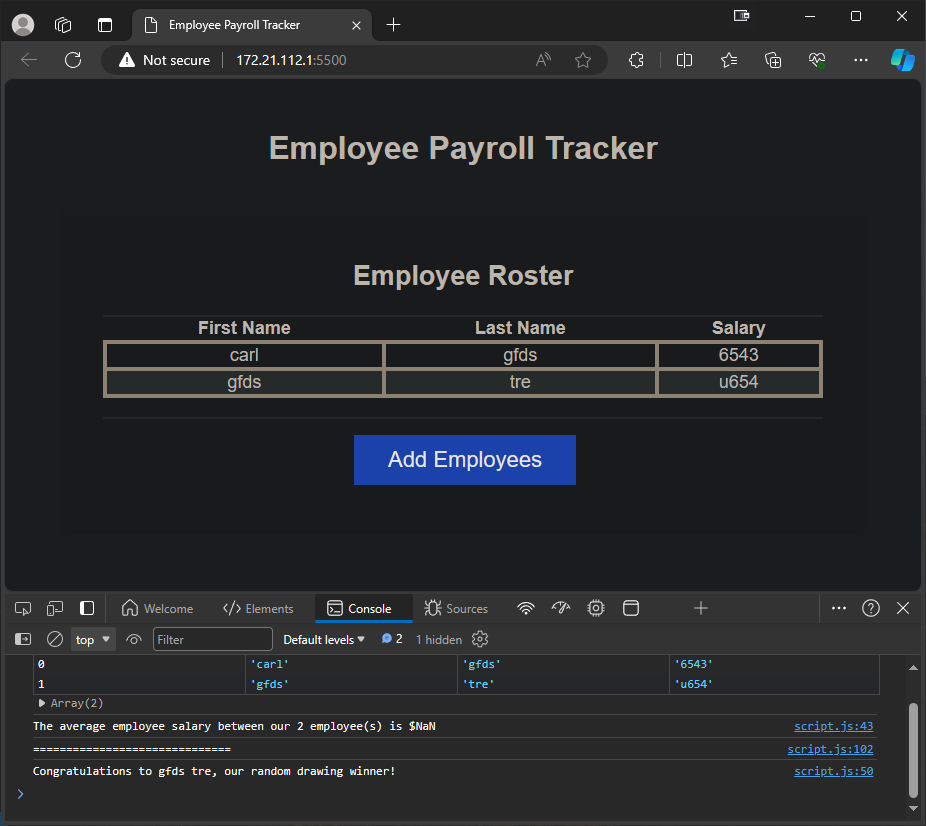

# BCS-Payroll-Tracker

### This project is a mockup where we had to code the logic for a few function to complete the functionality og a payroll tracker.

### Original Author: 
* **edX Boot Camps LLC**

### The original repo is at this addess: 
https://git.bootcampcontent.com/University-of-Central-Florida/UCF-VIRT-FSF-PT-02-2024-U-LOLC/-/tree/main/03-JavaScript/02-Challenge?ref_type=heads

 

# Changes:
### I added the logic for three functions:

### collectEmployees:
* In this function I just had to add le logic to collect the name, lastname and the salary of employees usign a while loop, window.promt and window.confirm

### displayAverageSalary:
*  in this function I just had to add the logic to calculate the average salary of all the employees and log it to the console.

### getRandomEmployee:
*  In this function I just had to add the logic to pick a random index from the employees array and log the employee at that index to the console

 

# Preview

**Application deployed at:**  
https://febres0492.github.io/bcs-payroll-tracker/

 

# Contributing 
>   N/A

 

# License
>   N/A

 

# Authors
**Carlos Febres**

